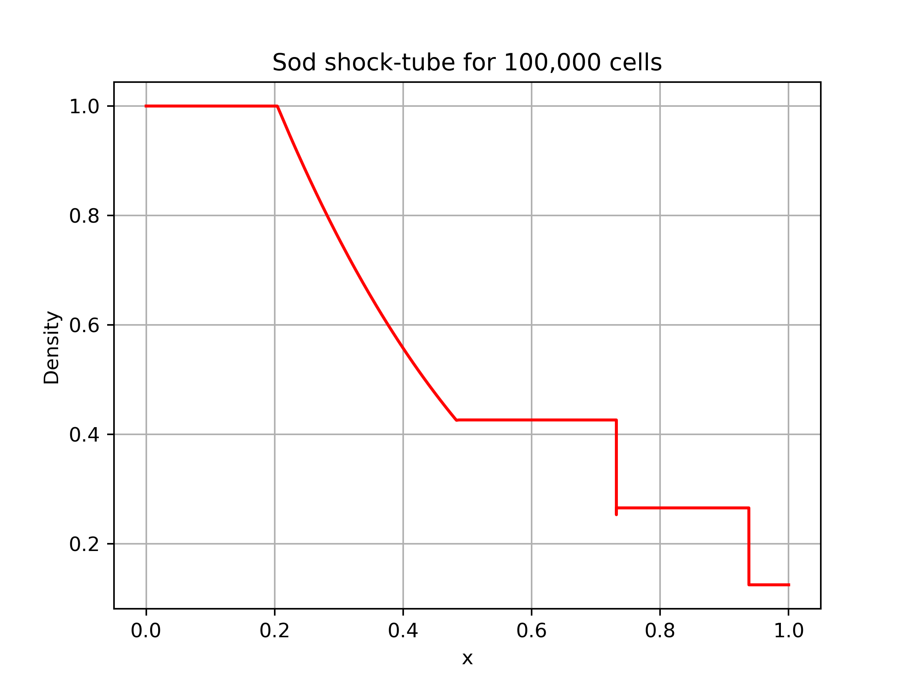

- [Refining the solver](#refining-the-solver)
  - [What the code does (physics/numerics)](#what-the-code-does-physicsnumerics)
    - [The Sod shock tube problem](#the-sod-shock-tube-problem)
  - [What's "wrong" with it and why do we want to change it?](#whats-wrong-with-it-and-why-do-we-want-to-change-it)
- [Implementing my changes](#implementing-my-changes)
  - [Parallelisation](#parallelisation)
    - [Why were some loops were left serial?](#why-were-some-loops-were-left-serial)
    - [What is the CFL condition and how/why did we treat it?](#what-is-the-cfl-condition-and-howwhy-did-we-treat-it)

# Refining the solver

Disclaimer: this document gives a brief overview of the changes made to the algorithm. For my results and discussion, please look at the file named `Question2.md`. This work was performed on an HPC with the following specs from the Cambridge HPC cluster

`Sapphire Rapids Nodes`

- **Hardware Specs:**  
  - **112 CPUs (cores)** per node.  
  - **4,580 MiB RAM per CPU**, totalling **512 GB RAM** per node.  
  - Interconnected via **Mellanox NDR200 InfiniBand**.  
- **Operating System:** Running **Rocky Linux 8**, a rebuild of **Red Hat Enterprise Linux 8 (RHEL8)**.  

> All runs used the above setup with cpu socket binding to minimise communication delays. 

All of the numerical results shown in this work were performed using a maximum of `32` cpu cores on the above node set. 


## What the code does (physics/numerics)

> This program is a 1D finite-element solver for the compressible Euler equations. It models shock propagation using Sod’s shock tube initial conditions. The solver sets up a 1D mesh, computes nodal and cell-centered quantities (positions, velocities, densities, pressures, and energies), and advances the solution in time using an explicit predictor–corrector scheme. OpenMP is used to parallelise loops over cells and nodes, and the program outputs density data to a file for post-processing.

To provide some physical context, we append below in Fig. 1 an example plot of the system for the following parameters 

- **Physical constant**: `gamma = 1.4` (ratio of specific heats).  
- **Numerical definitions**: end time `t=0.25`, start time `t=0`, time-step `dt = 1e-6`, step counter `i=1`.  
- **Mesh setup**: elements `n_el` (runtime input), nodes `n_nd=n_el+1`, positions equally spaced in `[0,1]`.  
- **Node-based parameters**:  
  - Velocity `u_i=0`  
  - Half-step positions `x_i^1/2`  
  - Nodal mass (computed from neighbours)  
  - Averaged velocity `ubar_i`  
- **Element-based fields**:  
  - Density `rho=1.0` (left), `0.125` (right)  
  - Pressure `p=1.0` (left), `0.1` (right)  
  - Internal energy `e = p / [ rho (gamma-1) ]`  
  - Volume `V = 1/n_el`  
  - Mass `M = rho*V`  
  - Artificial viscosity `q=0` (initial).  
- **Derived**: minimum CFL updated each time-step.

These are defined in the code as 

```c++
using ptr = std::unique_ptr<double[]>;

ptr ndx(new double[nnd]);       // node positions
ptr ndx05(new double[nnd]);     // half-step node positions
ptr ndm(new double[nnd]);       // Lagrangian nodal masses
ptr ndu(new double[nnd]);       // nodal velocities
ptr ndubar(new double[nnd]);    // nodal time-step-average velocities
ptr elrho(new double[nel]);     // cell densities
ptr elp(new double[nel]);       // cell pressures
ptr elq(new double[nel]);       // cell artificial viscosities
ptr elein(new double[nel]);     // cell specific internal energies
ptr elv(new double[nel]);       // cell volumes (lengths)
ptr elm(new double[nel]);       // Lagrangian cell masses
```

<!-- 
- `100,000` cells
- `dt = 1.0e-6`
- `tmax=`
- `gamma = 1.4`
</p>  -->

<p align="center">

<center>Fig. 1: example plot of shock-tube problem for 100,000 cells, </center>

### The Sod shock tube problem

Before exploring how to optimise this code, we shall briefly explore the physical problem it attempts to solve. In many situations, it (the Sod shock tube) is used to benchmark CFD codes since it gives a known, standard result and tests many aspects of the numerical scheme. The shock tube problem consists of a sealed, gas filled pipe. It is split in half such that there is a discontinuity in quantities such as density, pressure and temperature. Initially at $t=0$ there is *higher* pressure and density on the left hand side with the initial conditions essentially boiling down to a contact discontinuity separating two distinct initial states. 

In the standard case the density and pressure on the left are unity, The density on the right side of the diaphragm is 0.125 and the pressure is 0.1. The ratio of specific heats is 1.4. The initial conditions can be summarized in the following equation. Note that this is actually a formulation of the classical Riemann problem which can be extended to many different physical systems- please see https://www.sciencedirect.com/science/article/pii/S0165212524002105 for one such example.


## What's "wrong" with it and why do we want to change it?

Here, we identify the main issues with the code as it currently exists. There are 3 main areas of concern which we shall address:

1. Lack of Parallelisation. All loops over nodes and cells were executed sequentially.  
   1. Problem: For large meshes (e.g., 100k cells), this led to unnecessarily long runtimes on modern multi-core CPUs. Why it mattered: Computational loops like initialisation, time-stepping, and CFL calculations are best treated using parallel methods. Not exploiting this wastes available hardware resources and time. This is an especially important consideration when working with much more complex physical systems.

2. Unsafe or Inefficient Output. Density output was printed directly to stdout.
   1. Problem: For large meshes, this clutters the console and slows execution due to I/O bottlenecks. Why it mattered: Simulation output should be reproducible, structured, and separated from the console to allow automated post-processing and plotting.

3. Rigid Threading and Performance Testing. The code has no way to vary the number of threads.
   1. Problem: Users could not easily benchmark or optimise performance on different hardware. Why it mattered: Without benchmarking, you cannot understand scaling behavior, identify bottlenecks, or choose the optimal thread count.

# Implementing my changes

## Parallelisation

I systematically analysed all loops over cells and nodes to identify those that were independent and safe to parallelise. For loops where each iteration wrote to distinct array elements, we applied `#pragma omp` parallel for to execute iterations concurrently. For loops computing global aggregates, like the `minimum CFL condition`, we used `#pragma omp parallel for reduction(min:...)` to safely combine thread-local results without race conditions.

- [x] Loops were identified as independent if iterations wrote only to separate memory locations. Shared writes were avoided to prevent race conditions. Array access patterns were examined to minimise false sharing.


Loops with sequential dependencies, such as the corrector step updating nodal velocities, were intentionally left serial to maintain correctness. This approach maximised concurrency while avoiding synchronisation overhead and false sharing, resulting in significant runtime improvements on multi-core CPUs. The main goal of parallel execution is to reduce wall-clock time for computational tasks while maintaining numerical accuracy. In scientific computing, such as fluid dynamics solvers, parallelisation is essential to handle large-scale simulations efficiently.

### Why were some loops were left serial?

Not every aspect of the calculations is parallelisble. Example: Corrector step updating nodal velocities:

```c++
for (int ind = 0; ind < nnd; ind++) {
    // update velocity based on neighboring elements
    ndu[ind] += dt * a;
}
```

- Reason: Each iteration depends on values from neighboring nodes `(ndu[ind-1] or ndu[ind+1])`.
- If we parallelised this naively, threads could read stale values or overwrite each other, producing incorrect physics.
- Decision: Leave these loops serial to ensure numerical correctness. In other words, some calculations are inherently sequential due to data dependencies.

- [x] The factor `0.5` keeps the time-step well below the stability limit.

### What is the CFL condition and how/why did we treat it?  

> Definition:
> CFL = Courant–Friedrichs–Lewy condition.


When we simulate fluids explicitly, we need to make sure the time-step is small enough so that waves in the fluid don’t travel further than a cell in a single step- the CFL condition enforces this and prevents non-physical behaviour. The CFL condition ensures that in each time-step, no wave moves more than the size of its local cell, keeping the simulation stable and physically accurate.

Each cell in the simulation has its own volume (or length) and a local speed at which information travels, which includes:

1. The sound speed, determined by pressure and density.
1. The artificial viscosity, which acts like a local increase in wave speed in regions with shocks.
1. In the `gas.cpp`, this is calculated for each element as:

```c++
while (t < 0.25) {
  // Calculate artificial viscosity (Q) and minimum CFL condition.
  double min_cfl = std::numeric_limits<double>::max();
  for (int iel = 0; iel < nel; iel++) {

[...]

double const c2 = GAMMA*(GAMMA-1.0)*elein[iel];
elq[iel] = 0.75 * elrho[iel] * du*du +
           0.5 * elrho[iel] * std::sqrt(c2) * std::fabs(du);

// CFL condition (with Q correction to sound speed).
double const c2_corr = c2 + 2.0*elq[iel];
double const cfl = elv[iel] / std::max(1.0e-40, std::sqrt(c2_corr));
min_cfl = std::min(min_cfl, cfl);
```
Where
- `elv[iel]` is the cell length
- `elein[iel]` is the internal energy (determines sound speed)
- `elq[iel]` is the artificial viscosity (shocks correction)

This gives the maximum safe time-step for that cell. To maintain numerical stability, we need the minimum CFL across all cells.


Numerical stability refers to the property of a time-stepping scheme where errors do not grow uncontrollably as the simulation progresses (recall my presentation about the spectral method where if the high energy oscillations aren't treated, they quickly grow and destroy the solution).

For explicit methods solving hyperbolic PDEs (e.g., the KdV equation...), such as the Euler equations, the time-step `dt` must be small enough relative to the speed at which information propagates across the mesh. In this code, each cell has a *length* (`elv[iel]`) and a *local wave speed* (`sqrt(c2 + 2*elq[iel])`). The Courant–Friedrichs–Lewy (CFL) condition ensures that in one time-step, information from any cell does not travel further than the cell itself:

$$dt \le \frac{\text{cell length}}{\text{local wave speed}}$$

If `dt` is too large, waves can “jump over” cells, producing oscillations, non-physical results, or simulation blow-up.

**Implementation in Code:**

To make sure the CFL condition was observed in the new parallel form of the code, we use the `#pragma omp parallel for reduction` directive:

```cpp
double min_cfl = std::numeric_limits<double>::max();
#pragma omp parallel for reduction(min:min_cfl)
for (int iel = 0; iel < nel; iel++) {
    double cfl = elv[iel] / sqrt(c2 + 2*elq[iel]);
    min_cfl = std::min(min_cfl, cfl);
}
dt = 0.5 * min_cfl; // safety factor to ensure stability
```
This makes sense if one considers the problems at hand:

- We have a list of numbers — one CFL time-step for each cell.  
- We want **the smallest number** out of the list:

```cpp
for (int i = 0; i < nel; i++) {
    min_cfl = std::min(min_cfl, cfl[i]);
}
```

Doing this one after the other is not only slow for large numbers of cells and, critically, this could lead to a *race condition* in which all (or at least more than one thread) of the threads try to write to `min_cfl` at once and give an invalid answer (if, e.g, using OpenMP).

I thererfore changed this by adding

```c++
#pragma omp parallel for reduction(min:min_cfl)
```

So that:

- [x] Each thread calculates a local minimum.
- [x] OpenMP safely combines these into the global minimum at the end
- [x] Each thread gets its own copy of `min_cfl`. Each thread finds the smallest number in its own chunk of the list. 
