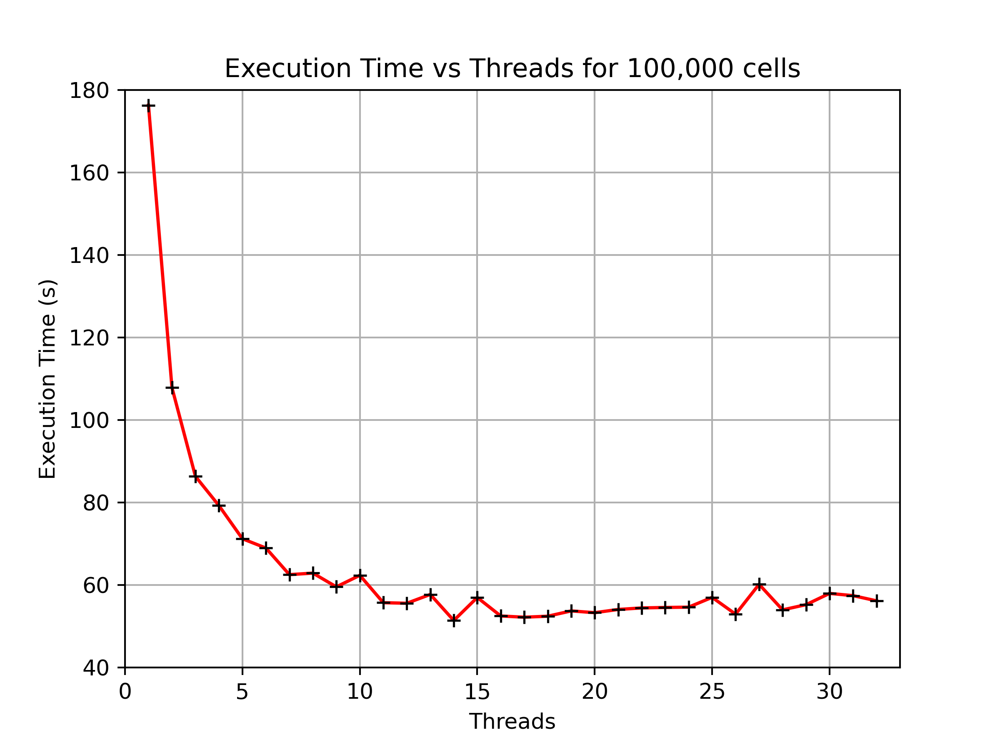
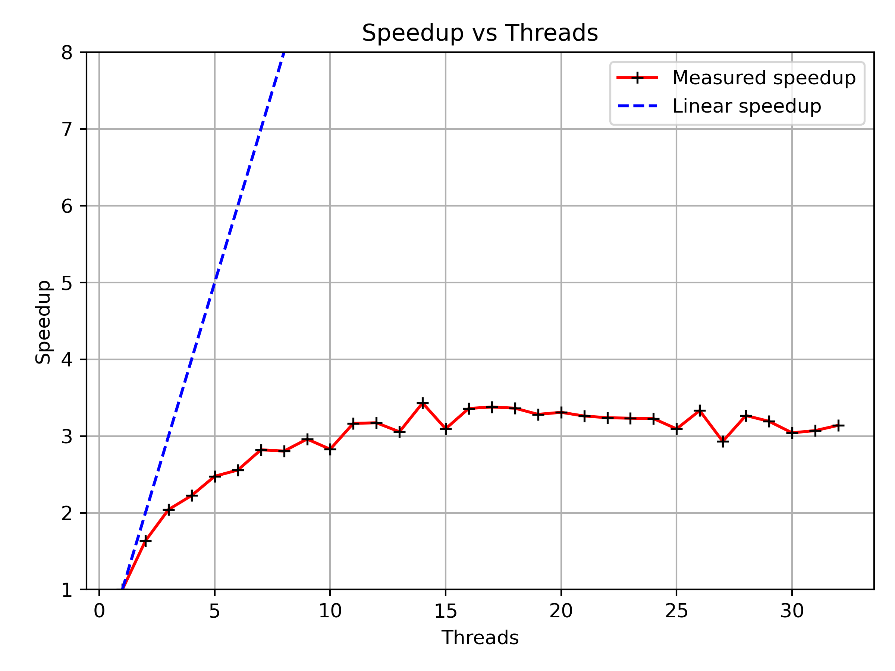
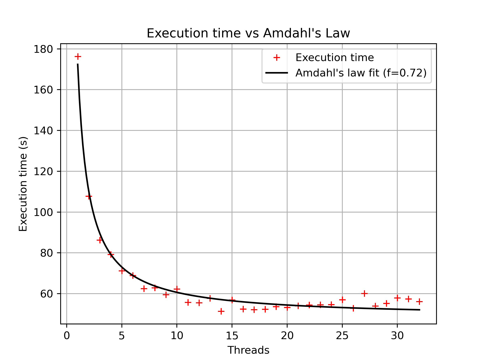
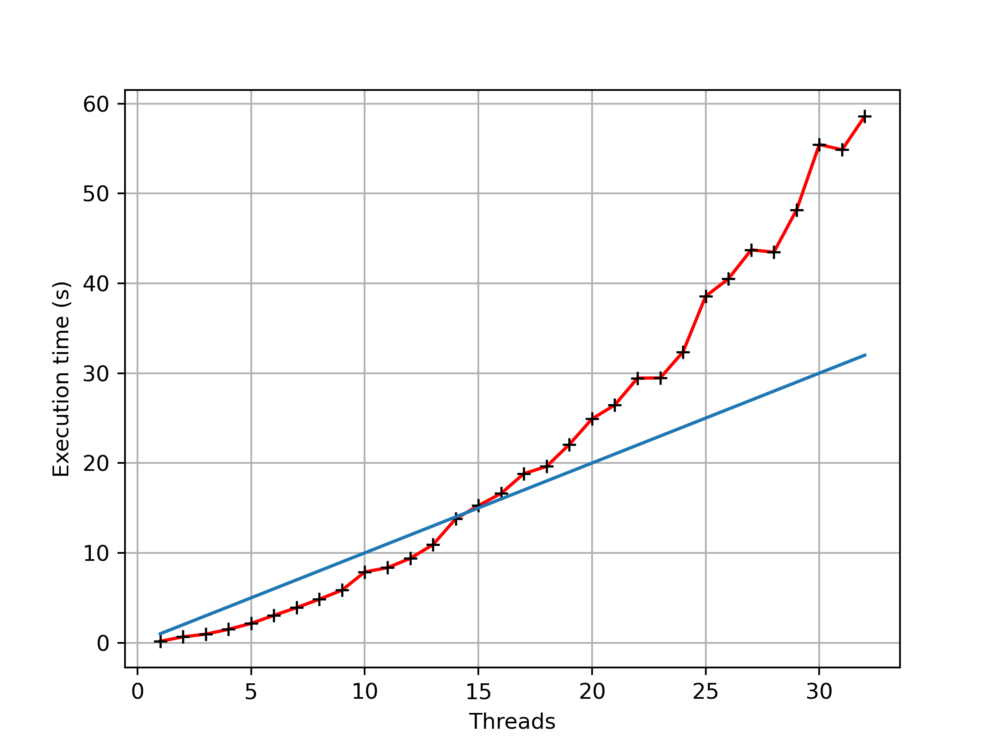
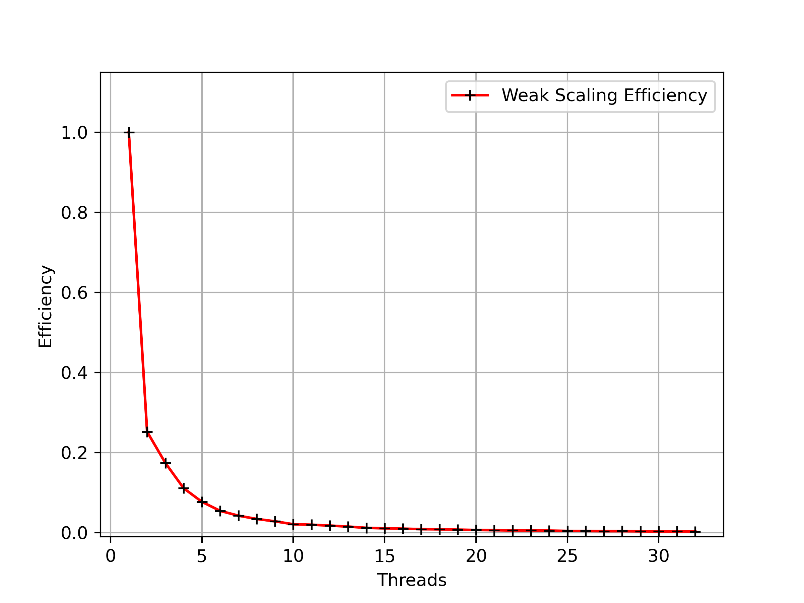

- [Testing and optimising the performance of the numerical scheme](#testing-and-optimising-the-performance-of-the-numerical-scheme)
  - [Scaling analysis](#scaling-analysis)
  - [Strong scaling](#strong-scaling)
    - [Determining efficiency of the code](#determining-efficiency-of-the-code)
    - [Determining *speedup* of the code](#determining-speedup-of-the-code)
    - [Applying Amdahl's Law](#applying-amdahls-law)
      - [Fitting execution time to Amdahl's Law](#fitting-execution-time-to-amdahls-law)
  - [Weak Scaling](#weak-scaling)
- [Summary and conclusion](#summary-and-conclusion)

# Testing and optimising the performance of the numerical scheme

Now that we are satisfied the code has been suitably parallelised, the task now is to examine its performance as 

- [ ] Cell count remains fixed and thread count is varied (strong scaling)
- [ ] Cell count remains constant but thread count is increased (varied problem size but same cell count per thread) this is known as "weak scaling"

From this, we can then make estimates of the efficiency, speedup and much more. 

## Scaling analysis

One (if not the most) critical aspect of our work involved the determination of the point at which the performance of the code either plateaus or begins to decrease with respect to the number of processor threads allocated to the task. To do this, the code was compiled with the `-fopenmp` flag it was decided to test it with the following parameters 

1. Fixed cell count of `100,000`
2. Varied thread count from `1` to `32`

There are many ways to measure the time of execution however for the sake of simplicity, we elected to delegate this task to a Python script (please cf. with `benchmark_threads.py` and `benchmark_cells.py`) which made use of the `subprocess` library to handle the execution. This script adopted the following workflow 

1. Define the path to the executable and output files
2. Initialise the parameters 
3. Set OpenMP environment variable:
   ```python
   env = os.environ.copy()
   env["OMP_NUM_THREADS"] = str(threads)
   ```
4. Run the executable using subprocess.run while suppressing stdout/stderr:
   ```python
   with open(os.devnull, 'w') as fnull:
      subprocess.run([executable, str(num_cells)], env=env, stdout=fnull, stderr=fnull)
   ```
5. Measure wallclock execution time
6. Write to csv.

## Strong scaling

### Determining efficiency of the code

The easiest and most logical method available to us is to simply run the code for an array of different thread counts whilst keeping the number of cells fixed (`100,000` to be precise). From this, one can readily plot execution time as a function of the number of threads as below:

<p align="center">

<center>Fig. 1: thread count vs execution time. </center>


We can readily see that performance (excluding some fluctuations in the order of 5-8s) steadily (exponentially) decreases until reaching an almost plateau-like stablility at 15 threads (where the execution time dips below 60 seconds). We can therefore make the straightforward observation that past 15 threads, one does **not** see an increase in performance- this is therefore our **scaling limit**. 

One leading cause of this is due to the fact that some of the code can only be executed in serial (we shall estimate this fraction later)- therefore adding more threads will not offer any benefit. One also has to account for the fact that, in terms of computing, this is a relatively small problem and the delays caused by communication overheads between e.g., nodes or the Lustre file system quickly diminish any gains offered by increasing the thread count. 

### Determining *speedup* of the code

We can also compute the *speedup* as a function of the number of threads. It is unsurprising that similarly, the degree at which the code is "sped up" (that is, the total execution time is observed to decrease) steadily reaches a plateu past the 15 cpu thread mark. 

The code *speedup* is determined by comparing the execution time of the program as a ratio of the time taken to execute it in serial (i.e., when the number of threads us unitary). 

We define 

- $T_1 =$ execution time with 1 thread (serial time)
- $T_{N_t} =$ execution time with $N_t$ threads

The speedup $S(N_t)$ is then defined as:

$$S(N_t) = \frac{T_1}{T_{N_t}}$$

And is plotted below in Fig. 2. It shows that the maximum boost offered by introducing `OpenMP` is approximately a factor of `3`. 

<p align="center">

<center>Fig. 2: thread count vs speedup. </center>

### Applying Amdahl's Law

Amdahl’s Law is a foundational principle in parallel computing, setting the theoretical upper bound on the maximum degree of *speedup* a given program can achieve when it is parallelised. 

It effectively places a limit on the maximum performance gain in accordance with the fraction of the code that must remain serial, no matter how many processors or threads are added. In practice, if a fraction $f_s$ of the program *cannot* be parallelised, then the maximum speedup with $N$ threads is given by

$$S(N) = \frac{1}{f_s + \frac{1-f_s}{N}}$$

This means that even when $N \to \infty$, the speedup cannot exceed $1/f_s$. 

For example, if just `5%` of a program is inherently serial (i.e., $f_s = 0.05$), the absolute maximum speedup possible is $20\times$, regardless of hardware. Amdahl's Law effectively explains why performance often plateaus beyond a certain thread count (as we have seen), since the serial bottleneck dominates once the parallel portion has been saturated. It underpins the importance of reducing serial regions of code and selecting an appropriate amount of computational resources.

#### Fitting execution time to Amdahl's Law

To understand how well the measured execution times align with the theoretical limits of parallel performance, we fit our data to Amdahl's Law. Amdahl's Law models the execution time $T(N)$ on $N$ threads as:

$$T(N) = T_1 \big[ (1 - f) + \tfrac{f}{N} \big]$$

where:

- $T_1$ is the serial execution time (1 thread),
- $f$ is the parallel fraction of the code ($0 \leq f \leq 1$),
- $N$ is the number of threads.

This model assumes that some fraction of the computation is perfectly parallelisable ($f$), while the remainder $(1-f)$ is inherently serial and cannot benefit from additional threads.

In the Python script, we use nonlinear least-squares fitting (`scipy.optimize.curve_fit`) to determine the best-fit values of $f$ and $T_1$ that minimise the difference between measured execution times and the Amdahl model. The workflow proceeds as follows:

<p align="center">

<center>Fig. 3: Amdahl''s law plotted against execution time. </center>

We see from this above analysis that the code is approximately `72%` of our workload is parallelisable (can be divided among threads) with `28%` appearing to be inherently serial (must be done on one thread, no matter how many cores are being added).


## Weak Scaling 

The weak scaling results are analysed by plotting the total wall-clock time as a function of the thread count. Ideally, in a perfectly scalable solver, the runtime remains constant as the problem size increases proportionally to the number of threads, reflecting the absence of inter-thread bottlenecks. Deviations from ideal scaling are interpreted in terms of load imbalance, cache contention, and memory bandwidth limitations. 

The results indicate near-ideal weak scaling for low to moderate thread counts, with slight departures for higher thread counts attributable to increased memory traffic and reduced per-thread cache utilisation. The analysis demonstrates that the solver maintains high parallel efficiency for dense Lagrangian meshes up to 100,000 cells distributed over 15–16 threads, providing a solid foundation for future investigations of multi-dimensional extensions and high-resolution shock-dominated flows.

<p align="center">

<center>Fig. 4: Wall-clock execution time as a function of OpenMP threads, with the total number of mesh cells increasing proportionally to maintain a constant workload of 3,125 cells per thread. </center>

Fig. 4. Shows the result of the weak-scaling analysis where the number of cells was held constant at `3,125` per thread. This analysis was intended to examine how the performance *scales* with respect to problem size **and** thread count. Even with ideal weak scaling (constant work per thread), shared-memory parallelism is rarely perfect: memory bandwidth, cache size, and threading overhead make the wall-clock time increase gradually as you add threads.

For thread counts up to approximately `1–10`, execution time increases roughly linearly with total problem size, indicating that the solver effectively distributes the workload and that memory bandwidth and cache effects remain manageable. 

Beyond this regime, however, runtime grows more rapidly, displaying a near-exponential trend, which becomes noticeable for thread counts exceeding `20`. E.g., whilst the runtime for `16` threads (`50,000` cells) is `16.6s`, doubling the thread count to `32` (`100,000` cells) increases the runtime to `58.6s`; more than a **threefold** increase, even though each thread handles the same number of cells.


<p align="center">

<center>Fig. 5: Efficiency vs. OpenMP threads, with the total number of mesh cells increasing proportionally to maintain a constant workload of 3,125 cells per thread. </center>

The weak scaling efficiency, defined as $E=t_1/t_N$ with $t_1$ the single-thread runtime and $t_N$ the runtime at $N$ threads, exhibits a pronounced decline as the number of threads increases in Figure 5.

For a $N=1$, efficiency is naturally, however, with just two threads, efficiency drops sharply to approximately `25%`, reflecting the significant influence of parallel overheads relative to the small per-thread workload of `3,125` cells.

As the thread count continues to rise, efficiency decreases almost exponentially: by `8` threads it falls below `3%`, and by 32 threads it reaches less than `2%` relative to the single-thread baseline. 

This behaviour indicates that the additional threads contribute *disproportionately* to memory bandwidth saturation, cache contention, and OpenMP runtime overhead, rather than accelerating computation. In particular, operations such as the parallel reductions for CFL timestep evaluation and frequent updates of arrays (`ndx`, `ndu`, `elv`, `elrho`) exacerbate contention for shared memory resources, causing exponential growth in runtime. One can conclude then that an exponential decrease in efficiency manifests as an exponential *increase* in wall-clock time.

# Summary and conclusion 

The performance analysis of the parallel solver demonstrates the balance between parallelism, hardware characteristics, and practical limitations of shared-memory computation. 

Strong scaling studies revealed that execution time decreases with increasing thread count up to a practical limit of `~15` threads, beyond which the benefits of parallelism are dominated by inherently serial regions of the code, memory access latency, and threading overhead. Speedup analysis confirms that the maximum acceleration achieved with OpenMP is approximately threefold, consistent with Amdahl’s Law, which identifies `~28%` of the workload as serial.

Weak scaling results further illuminate the constraints imposed by memory hierarchy and inter-thread contention. While the solver maintains near-ideal scaling for small to moderate thread counts, execution time grows rapidly and efficiency declines almost exponentially for large numbers of threads, even with constant work per thread. This indicates that additional threads contribute disproportionately to overhead rather than computation, highlighting the dominant influence of cache utilisation, memory bandwidth, and reduction synchronisation in limiting scalability.

Taken together, these results provide a quantitative benchmark for the solver’s parallel performance and establish clear guidelines for future optimisation. High parallel efficiency is attainable when each thread is assigned a sufficiently large workload.